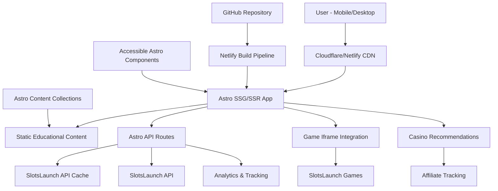
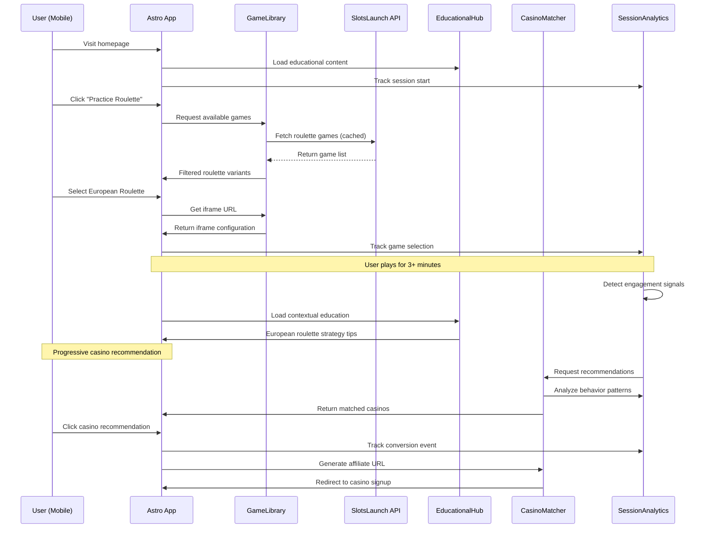
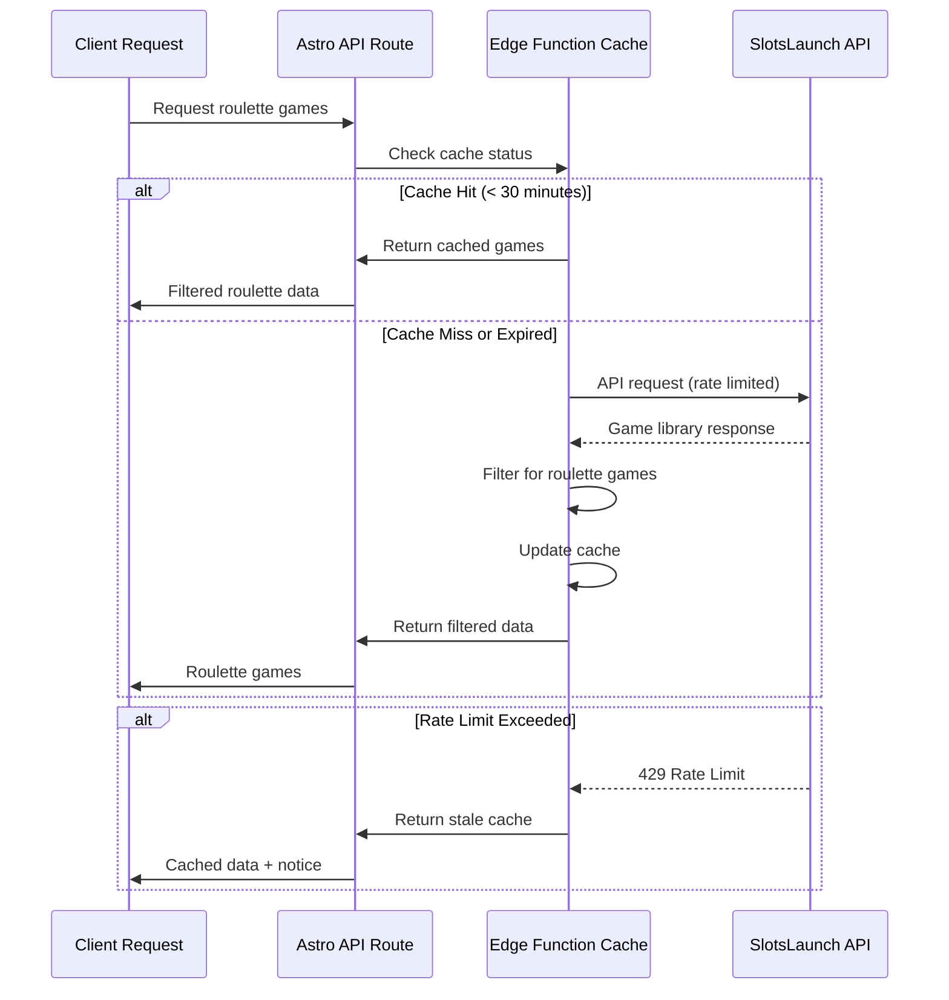
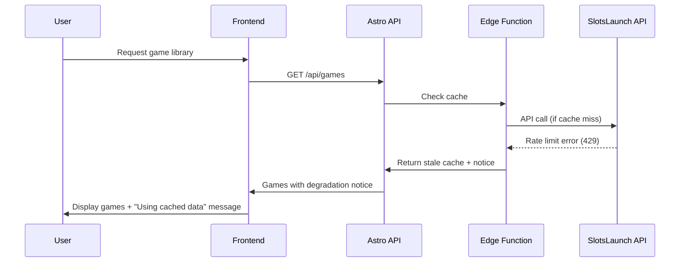

# Roulettesim.com Fullstack Architecture Document

## Introduction

Based on the PRD requirements and front-end specification, this document outlines the complete fullstack architecture for **Roulettesim.com** that covers both backend systems, frontend implementation, and their integration. This architecture leverages Astro's hybrid capabilities with SlotsLaunch API integration, Accessible Astro Components, and Netlify deployment to deliver the mobile-first roulette education platform.

This unified approach streamlines development for the 4-epic roadmap where frontend educational content and backend API integration are tightly coupled through Astro's island architecture.

### Starter Template Analysis

The project is based on **Accessible Astro Starter** and **Accessible Astro Components**, providing:
- WCAG AA compliance foundation
- Pre-built accessible navigation, forms, and UI patterns  
- TypeScript support and component organization
- Astro's performance optimizations and SEO features
- Responsive design patterns ready for customization

**Architectural Constraints from Starter:**
- Astro's file-based routing in `src/pages/`
- Component architecture in `src/components/`
- Content collections support for educational content
- Must adapt blog structure to Games/Strategy/Casinos navigation

### Change Log

| Date | Version | Description | Author |
|------|---------|-------------|---------|
| 2025-09-03 | v1.0 | Initial fullstack architecture from PRD and UX specifications | Architect |

## High Level Architecture

### Technical Summary

Roulettesim.com employs an **Astro hybrid architecture** combining static generation for educational content with SSR endpoints for SlotsLaunch API integration and user analytics. The platform leverages Accessible Astro Starter's component foundation with custom roulette-specific components, deployed via **Netlify's CDN** with automatic GitHub integration. **SlotsLaunch API integration** provides authentic casino roulette games through responsive iframe embedding, while **Astro content collections** manage YMYL-compliant educational content with TypeScript validation. The architecture prioritizes **mobile-first responsive design** with intelligent caching strategies to meet 2 r/s API rate limits and <3 second load time requirements.

### Platform and Infrastructure Choice 

**Platform:** Netlify  
**Key Services:** Netlify CDN, Edge Functions, Forms, Analytics
**Deployment Host and Regions:** Global CDN with edge optimization for mobile performance

### Repository Structure

**Structure:** Monorepo using npm workspaces  
**Monorepo Tool:** Native npm workspaces (simpler than Turborepo for this scale)
**Package Organization:** Single Astro app with shared TypeScript interfaces for SlotsLaunch API data

### High Level Architecture Diagram



### Architectural Patterns

- **Jamstack + Islands Architecture:** Static educational content with hydrated interactive components for game integration - _Rationale:_ Optimal performance for content-heavy platform with specific interactivity needs
- **Progressive Enhancement:** Touch-optimized mobile-first with desktop feature enhancement - _Rationale:_ 60-70% mobile traffic requires core functionality to work on all devices  
- **Component-Based UI:** Reusable Accessible Astro Components with custom roulette variants - _Rationale:_ WCAG AA compliance and development velocity through proven accessibility patterns
- **Content-First Architecture:** Educational content drives navigation and conversion paths - _Rationale:_ YMYL compliance and SEO authority require content to be architectural foundation
- **Iframe Integration Pattern:** Third-party game embedding with educational context overlay - _Rationale:_ SlotsLaunch API mandate for iframe usage with responsive educational integration
- **Edge Caching Strategy:** Client-side SlotsLaunch API caching with Netlify Edge Functions - _Rationale:_ 2 r/s rate limits require intelligent caching without losing real-time game availability

## Tech Stack

| Category | Technology | Version | Purpose | Rationale |
|----------|------------|---------|---------|-----------|
| Frontend Language | TypeScript | 5.0+ | Type-safe development across components and API integration | Essential for SlotsLaunch API data validation and shared interfaces |
| Frontend Framework | Astro | 4.0+ | Hybrid SSG/SSR with island architecture | Perfect for content-heavy educational site with selective interactivity |
| UI Component Library | Accessible Astro Components | Latest | WCAG AA compliant UI foundation | Pre-built accessibility compliance for YMYL content requirements |
| State Management | Nanostores | 0.9+ | Lightweight state for iframe integration | Minimal overhead for game state and user preferences |
| Backend Language | TypeScript | 5.0+ | Server-side API integration and caching | Shared types with frontend for SlotsLaunch API responses |
| Backend Framework | Astro API Routes + Netlify Edge Functions | Latest | Serverless API endpoints with edge caching | Native Astro integration with Netlify's global edge network |
| API Style | REST | - | Simple HTTP endpoints for SlotsLaunch proxy | Straightforward integration with rate limiting and caching |
| Database | None (Static/Cached) | - | Educational content via content collections | Content-driven architecture with API caching, no persistent user data |
| Cache | Netlify Edge Functions + Browser Cache | - | SlotsLaunch API response caching | Required for 2 r/s rate limit compliance |
| File Storage | Netlify CDN | - | Static assets and educational content | Integrated with Astro build pipeline |
| Authentication | None (Phase 1) | - | No user accounts in initial implementation | Simplified architecture focusing on content and conversion |
| Frontend Testing | Vitest + @astro/test | Latest | Component and integration testing | Native Astro testing support |
| Backend Testing | Vitest | Latest | API route and edge function testing | Unified testing framework across stack |
| E2E Testing | Playwright | Latest | Full user journey testing including iframe interaction | Critical for SlotsLaunch iframe integration validation |
| Build Tool | Astro CLI | Latest | Native framework build system | Optimized for hybrid SSG/SSR architecture |
| Bundler | Vite (via Astro) | 5.0+ | Fast development and production builds | Built into Astro with excellent TypeScript support |
| IaC Tool | Netlify Configuration | - | Infrastructure as code via netlify.toml | Simple declarative config for edge functions and redirects |
| CI/CD | GitHub Actions + Netlify | - | Automated testing and deployment | Integrated pipeline from code push to live deployment |
| Monitoring | Netlify Analytics + Web Vitals | - | Performance and user behavior tracking | Essential for 8-12% conversion rate optimization |
| Logging | Netlify Functions Logs + Console | - | Error tracking and debugging | Sufficient for serverless architecture scope |
| CSS Framework | Tailwind CSS (via Accessible Astro) | 3.0+ | Utility-first responsive styling | Pre-configured in Accessible Astro Starter |

## Data Models

### RouletteGame

**Purpose:** Represents authentic roulette games from SlotsLaunch API with metadata for filtering and display

#### TypeScript Interface
```typescript
interface RouletteGame {
  id: string;
  name: string;
  provider: string;
  variant: 'european' | 'american' | 'french';
  thumbnail: string;
  iframeUrl: string;
  isAvailable: boolean;
  metadata: {
    minBet: number;
    maxBet: number;
    features: string[];
    popularity: number;
  };
  cacheTimestamp: number;
}

type RouletteVariant = 'european' | 'american' | 'french';
```

#### Relationships
- Referenced by UserSession for game preference tracking
- Used by CasinoRecommendation for variant-specific casino matching

### EducationalContent

**Purpose:** YMYL-compliant educational articles managed via Astro content collections with SEO optimization

#### TypeScript Interface
```typescript
interface EducationalContent {
  slug: string;
  title: string;
  category: 'rules' | 'strategies' | 'responsible-gambling' | 'odds-probability';
  relatedVariant: RouletteVariant[];
  authorCredentials: {
    name: string;
    title: string;
    credentials: string[];
  };
  seoMetadata: {
    description: string;
    keywords: string[];
    schema: object;
  };
  content: string;
  lastUpdated: Date;
  readingTime: number;
}
```

#### Relationships
- Links to RouletteGame variants for educational context during gameplay
- Referenced by UserSession for engagement tracking

### UserSession

**Purpose:** Anonymous user behavior tracking for casino recommendation personalization and conversion optimization

#### TypeScript Interface
```typescript
interface UserSession {
  sessionId: string;
  gamePreferences: {
    variant: RouletteVariant;
    playDuration: number;
    frequency: number;
  }[];
  educationalEngagement: {
    contentSlug: string;
    timeSpent: number;
    completionRate: number;
    returnVisits: number;
  }[];
  conversionSignals: {
    type: 'game-engagement' | 'education-completion' | 'casino-interest';
    strength: number;
    timestamp: Date;
  }[];
  createdAt: Date;
  lastActivity: Date;
}
```

#### Relationships
- Drives CasinoRecommendation matching algorithm
- References RouletteGame and EducationalContent for preference analysis

### CasinoRecommendation

**Purpose:** Intelligent casino matching based on user behavior with affiliate tracking integration

#### TypeScript Interface
```typescript
interface CasinoRecommendation {
  casinoId: string;
  name: string;
  supportedVariants: RouletteVariant[];
  features: {
    liveDealers: boolean;
    mobileApp: boolean;
    bonusOffering: string;
    reputation: number;
  };
  matchingScore: number;
  affiliateUrl: string;
  geographicAvailability: string[];
  conversionData: {
    clickThroughRate: number;
    conversionRate: number;
    lastUpdated: Date;
  };
}
```

#### Relationships
- Matched to UserSession behavior patterns
- Filtered by RouletteGame variants played

## External APIs

### SlotsLaunch API

- **Purpose:** Authentic casino roulette game integration with mandatory iframe embedding
- **Documentation:** [User provided - not specified in PRD]
- **Base URL(s):** https://api.slotslaunch.com/v1/ (games), https://slotslaunch.com/iframe/ (embedding)
- **Authentication:** API Token + Origin header validation
- **Rate Limits:** 2 requests/second (premium), 0.5 requests/second (free tier)

**Key Endpoints Used:**
- `GET /games` - Retrieve complete game library for roulette filtering
- `GET /games/{id}` - Get specific game details and iframe configuration
- `GET /games/search` - Search games by type/theme parameters for roulette identification

**Integration Notes:** 
- Mandatory iframe embedding via slotslaunch.com/iframe/{game_id} URLs
- Client-side caching required by API terms to stay within rate limits
- Games must be filtered by type/theme parameters to identify roulette variants from 17K+ total games
- Origin header must match registered domain for authentication
- Responsive iframe embedding requires custom container logic for mobile optimization

## Core Workflows

### Primary User Journey: Education to Casino Conversion



### SlotsLaunch API Caching Workflow



## Database Schema

### Astro Content Collection Schemas

```typescript
// src/content/config.ts
import { defineCollection, z } from 'astro:content';

const educationalContent = defineCollection({
  type: 'content',
  schema: z.object({
    title: z.string(),
    description: z.string(),
    category: z.enum(['rules', 'strategies', 'responsible-gambling', 'odds-probability']),
    relatedVariant: z.array(z.enum(['european', 'american', 'french'])),
    authorCredentials: z.object({
      name: z.string(),
      title: z.string(),
      credentials: z.array(z.string()),
    }),
    seoKeywords: z.array(z.string()),
    lastUpdated: z.date(),
    readingTime: z.number(),
    featured: z.boolean().default(false),
    responsibleGambling: z.boolean().default(true),
  }),
});

const casinoPartners = defineCollection({
  type: 'data',
  schema: z.object({
    casinoId: z.string(),
    name: z.string(),
    supportedVariants: z.array(z.enum(['european', 'american', 'french'])),
    features: z.object({
      liveDealers: z.boolean(),
      mobileApp: z.boolean(),
      bonusOffering: z.string(),
      reputation: z.number().min(1).max(10),
    }),
    affiliateUrl: z.string().url(),
    geographicAvailability: z.array(z.string()),
    conversionPriority: z.number(),
    lastVerified: z.date(),
  }),
});

export const collections = {
  'educational': educationalContent,
  'casinos': casinoPartners,
};
```

## Frontend Architecture

### Component Architecture

#### Component Organization
```
src/
├── components/
│   ├── ui/                          # Accessible Astro Components wrappers
│   │   ├── Button.astro
│   │   ├── Card.astro  
│   │   ├── Modal.astro
│   │   └── Navigation.astro
│   ├── game/                        # Roulette game integration
│   │   ├── GameFrame.astro          # SlotsLaunch iframe wrapper
│   │   ├── GameLibrary.astro        # Game discovery interface
│   │   ├── VariantSelector.astro    # European/American/French selection
│   │   └── GameControls.tsx         # Interactive game controls (React island)
│   ├── education/                   # Educational content components  
│   │   ├── EducationalSidebar.astro # Contextual learning content
│   │   ├── StrategyGuide.astro      # Strategy explanations
│   │   ├── RuleExplainer.astro      # Game rules breakdown
│   │   └── ResponsibleGambling.astro # Risk awareness messaging
│   ├── conversion/                  # Casino recommendation components
│   │   ├── CasinoRecommendations.astro # Personalized casino matching
│   │   ├── ProgressiveCTA.tsx       # Smart conversion prompts (React island)
│   │   ├── CasinoMatcher.astro      # Recommendation engine UI
│   │   └── TrustSignals.astro       # Authority and credibility indicators
│   └── layout/                      # Site structure components
│       ├── Header.astro             # Main navigation
│       ├── Footer.astro             # Links and compliance
│       ├── Layout.astro             # Base page template
│       └── SEOHead.astro            # Meta tags and schema markup
```

#### Component Template
```typescript
// Example: GameFrame.astro (SlotsLaunch iframe integration)
---
export interface Props {
  gameId: string;
  variant: 'european' | 'american' | 'french';
  className?: string;
}

const { gameId, variant, className = '' } = Astro.props;

// Server-side iframe URL generation
const gameData = await fetch(`/api/games/${gameId}/iframe`);
const { iframeUrl } = await gameData.json();
---

<div class={`game-frame ${className}`} data-variant={variant}>
  <iframe 
    src={iframeUrl}
    title={`${variant} roulette game`}
    allow="fullscreen"
    loading="lazy"
    class="w-full h-full border-0 rounded-lg"
  ></iframe>
  
  <!-- Progressive enhancement for iframe interaction -->
  <GameControls gameId={gameId} client:load />
</div>

<style>
  .game-frame {
    aspect-ratio: 16/9;
    min-height: 400px;
    max-height: 80vh;
    position: relative;
  }
  
  @media (max-width: 768px) {
    .game-frame {
      aspect-ratio: 4/3;
      min-height: 300px;
    }
  }
</style>
```

### State Management Architecture

#### State Structure
```typescript
// stores/gameState.ts (Nanostores)
import { atom, map } from 'nanostores';

export const currentGame = atom<RouletteGame | null>(null);
export const gameLibrary = atom<RouletteGame[]>([]);
export const isGameLoading = atom<boolean>(false);

export const userPreferences = map({
  preferredVariant: 'european' as RouletteVariant,
  sessionStartTime: Date.now(),
  educationProgress: {} as Record<string, number>,
});

export const conversionState = map({
  showRecommendations: false,
  engagementLevel: 0,
  conversionSignals: [] as ConversionSignal[],
});
```

#### State Management Patterns
- Reactive stores for cross-component game state sharing
- Server-rendered initial state with client-side hydration for interactions
- Persistent preferences via localStorage with privacy-compliant session management
- Event-driven updates for iframe interaction and educational content engagement

### Routing Architecture

#### Route Organization
```
src/pages/
├── index.astro                      # Homepage with game showcase
├── games/
│   ├── index.astro                  # Game library grid
│   ├── european-roulette.astro      # European variant games
│   ├── american-roulette.astro      # American variant games
│   ├── french-roulette.astro        # French variant games
│   └── [gameId].astro               # Individual game play interface
├── strategy/
│   ├── index.astro                  # Strategy hub landing
│   ├── [slug].astro                 # Educational content pages
│   └── [...category]/               # Category-based content organization
├── casinos/
│   ├── index.astro                  # Casino recommendations
│   ├── matcher.astro                # Interactive casino matching tool
│   └── [casinoId].astro             # Individual casino details
└── api/
    ├── games/
    │   ├── index.ts                 # Game library endpoint
    │   └── [gameId]/
    │       └── iframe.ts            # Iframe URL generation
    ├── analytics/
    │   └── session.ts               # Session tracking endpoint
    └── recommendations.ts           # Casino matching endpoint
```

### Frontend Services Layer

#### API Client Setup
```typescript
// services/apiClient.ts
class RouletteSimAPI {
  private baseUrl = import.meta.env.PUBLIC_API_URL || '/api';
  
  async getRouletteGames(filters: GameFilters = {}): Promise<RouletteGame[]> {
    const params = new URLSearchParams(filters as any);
    const response = await fetch(`${this.baseUrl}/games?${params}`);
    
    if (!response.ok) {
      throw new APIError('Failed to fetch games', response.status);
    }
    
    const data = await response.json();
    return data.games;
  }
  
  async trackUserBehavior(event: SessionEvent): Promise<void> {
    await fetch(`${this.baseUrl}/analytics/session`, {
      method: 'POST',
      headers: { 'Content-Type': 'application/json' },
      body: JSON.stringify(event),
    });
  }
  
  async getCasinoRecommendations(sessionId: string): Promise<CasinoRecommendation[]> {
    const response = await fetch(`${this.baseUrl}/recommendations`, {
      method: 'POST',
      headers: { 'Content-Type': 'application/json' },
      body: JSON.stringify({ sessionId }),
    });
    
    return response.json();
  }
}

export const api = new RouletteSimAPI();
```

## Backend Architecture

### Service Architecture - Serverless Astro + Netlify Edge Functions

#### Function Organization
```
netlify/
├── edge-functions/
│   ├── cache-games.ts               # SlotsLaunch API caching with rate limiting
│   ├── analytics-collector.ts       # Session data aggregation  
│   └── casino-matcher.ts            # Recommendation algorithm execution
├── functions/
│   └── scheduled-refresh.ts         # Periodic cache refresh (background)
src/api/
├── games/
│   ├── index.ts                     # Game library proxy endpoint
│   └── [gameId]/iframe.ts           # Iframe URL validation
├── analytics/
│   └── session.ts                   # Session tracking endpoint  
├── recommendations.ts               # Casino matching API
└── health.ts                        # System health monitoring
```

#### Function Template
```typescript
// netlify/edge-functions/cache-games.ts
import type { Context } from "@netlify/edge-functions";
import type { RouletteGame } from "../../src/types/game.ts";

const CACHE_DURATION = 30 * 60 * 1000; // 30 minutes
const RATE_LIMIT_WINDOW = 1000; // 1 second
let lastApiCall = 0;

export default async function cacheGames(request: Request, context: Context) {
  const url = new URL(request.url);
  const cacheKey = `games-${url.searchParams.toString()}`;
  
  // Check edge cache first
  const cached = await context.storage.get(cacheKey);
  if (cached && (Date.now() - cached.timestamp) < CACHE_DURATION) {
    return Response.json(cached.data);
  }
  
  // Rate limiting check
  const now = Date.now();
  if (now - lastApiCall < RATE_LIMIT_WINDOW) {
    // Return stale cache if available
    if (cached) {
      return Response.json({
        ...cached.data,
        notice: "Using cached data due to rate limits"
      });
    }
    return Response.json({ error: "Rate limit exceeded, no cache available" }, { status: 429 });
  }
  
  try {
    lastApiCall = now;
    const response = await fetch('https://api.slotslaunch.com/v1/games', {
      headers: {
        'Authorization': `Bearer ${Deno.env.get('SLOTSLAUNCH_API_TOKEN')}`,
        'Origin': 'https://roulettesim.com'
      }
    });
    
    const allGames = await response.json();
    
    // Filter for roulette games only
    const rouletteGames = allGames.games.filter((game: any) => 
      game.type?.toLowerCase().includes('roulette') ||
      game.theme?.toLowerCase().includes('roulette') ||
      game.category?.toLowerCase().includes('table-games')
    );
    
    const processedGames: RouletteGame[] = rouletteGames.map(game => ({
      id: game.id,
      name: game.name,
      provider: game.provider,
      variant: detectRouletteVariant(game.name),
      thumbnail: game.thumbnail,
      iframeUrl: `https://slotslaunch.com/iframe/${game.id}`,
      isAvailable: game.isActive,
      metadata: {
        minBet: game.minBet || 1,
        maxBet: game.maxBet || 1000,
        features: game.features || [],
        popularity: game.popularity || 50
      },
      cacheTimestamp: now
    }));
    
    // Cache the processed results
    await context.storage.set(cacheKey, {
      data: { games: processedGames },
      timestamp: now
    });
    
    return Response.json({ games: processedGames });
    
  } catch (error) {
    console.error('SlotsLaunch API error:', error);
    
    // Fallback to stale cache
    if (cached) {
      return Response.json({
        ...cached.data,
        notice: "API unavailable, using cached data"
      });
    }
    
    return Response.json({ error: "Games temporarily unavailable" }, { status: 503 });
  }
}

function detectRouletteVariant(gameName: string): RouletteGame['variant'] {
  const name = gameName.toLowerCase();
  if (name.includes('european')) return 'european';
  if (name.includes('american')) return 'american'; 
  if (name.includes('french')) return 'french';
  return 'european'; // Default to best odds variant
}
```

## Unified Project Structure

```plaintext
roulettesim.com/
├── .github/                         # CI/CD workflows
│   └── workflows/
│       ├── ci.yaml                  # Test and build validation
│       └── deploy.yaml              # Netlify deployment trigger
├── .bmad-core/                      # BMAD agent configuration
├── docs/                            # Project documentation
│   ├── prd.md                       # Product requirements
│   ├── front-end-spec.md            # UX specifications
│   ├── architecture.md              # This document
│   └── api-integration.md           # SlotsLaunch integration guide
├── netlify/                         # Netlify-specific configurations
│   ├── edge-functions/              # Edge function implementations
│   │   ├── cache-games.ts           # Game caching with rate limiting
│   │   ├── analytics-collector.ts   # Session data aggregation
│   │   └── casino-matcher.ts        # Recommendation algorithm
│   ├── functions/                   # Serverless functions
│   │   └── scheduled-refresh.ts     # Background cache refresh
│   └── netlify.toml                 # Deployment configuration
├── src/                             # Main Astro application
│   ├── components/                  # UI component library
│   │   ├── ui/                      # Accessible Astro Components
│   │   ├── game/                    # Game integration components
│   │   ├── education/               # Educational content components
│   │   ├── conversion/              # Casino recommendation components
│   │   └── layout/                  # Site structure components
│   ├── content/                     # Astro content collections
│   │   ├── educational/             # Strategy guides and rules
│   │   │   ├── european-rules.md
│   │   │   ├── basic-strategies.md
│   │   │   └── responsible-gambling.md
│   │   └── casinos/                 # Casino partner data
│   │       ├── casino-alpha.json
│   │       └── casino-beta.json
│   ├── layouts/                     # Page layout templates
│   │   ├── BaseLayout.astro         # Global layout with SEO
│   │   ├── GameLayout.astro         # Game play interface layout
│   │   └── EducationLayout.astro    # Educational content layout
│   ├── pages/                       # File-based routing
│   │   ├── index.astro              # Homepage
│   │   ├── games/                   # Game discovery and play
│   │   ├── strategy/                # Educational content
│   │   ├── casinos/                 # Casino recommendations
│   │   └── api/                     # API routes
│   ├── stores/                      # Nanostores state management
│   │   ├── gameState.ts             # Game selection and preferences
│   │   ├── sessionState.ts          # User behavior tracking
│   │   └── conversionState.ts       # Casino recommendation state
│   ├── services/                    # Frontend service layer
│   │   ├── apiClient.ts             # API communication
│   │   ├── gameService.ts           # Game management logic
│   │   ├── analyticsService.ts      # User behavior tracking
│   │   └── casinoService.ts         # Recommendation logic
│   ├── types/                       # Shared TypeScript definitions
│   │   ├── game.ts                  # RouletteGame interfaces
│   │   ├── content.ts               # Educational content types
│   │   ├── casino.ts                # Casino recommendation types
│   │   └── analytics.ts             # Session tracking types
│   ├── styles/                      # Global styles and themes
│   │   ├── global.css               # Base styles with Tailwind
│   │   ├── components.css           # Component-specific styles
│   │   └── accessibility.css        # WCAG AA enhancements
│   └── utils/                       # Shared utilities
│       ├── gameFilters.ts           # Roulette variant filtering
│       ├── conversionTracking.ts    # Behavior analysis utilities
│       └── seoHelpers.ts            # SEO and schema markup
├── public/                          # Static assets
│   ├── images/                      # Game screenshots and education visuals
│   ├── icons/                       # Favicon and app icons
│   └── robots.txt                   # SEO crawler instructions
├── tests/                           # Testing suite
│   ├── unit/                        # Component and service tests
│   ├── integration/                 # API integration tests
│   └── e2e/                         # End-to-end user journey tests
├── .env.example                     # Environment variable template
├── astro.config.mjs                 # Astro framework configuration
├── package.json                     # Dependencies and scripts
├── tailwind.config.cjs              # Tailwind CSS configuration
├── tsconfig.json                    # TypeScript configuration
└── README.md                        # Development setup guide
```

## Development Workflow

### Local Development Setup

#### Prerequisites
```bash
# Required software versions
node --version  # v18.0.0+
npm --version   # v9.0.0+
git --version   # v2.30.0+
```

#### Initial Setup
```bash
# Clone and setup project
git clone https://github.com/your-org/roulettesim.com.git
cd roulettesim.com
npm install

# Copy environment variables
cp .env.example .env.local
# Edit .env.local with your SlotsLaunch API credentials

# Install Accessible Astro Components
npm install accessible-astro-components

# Start development server
npm run dev
```

#### Development Commands
```bash
# Start all services
npm run dev                          # Astro dev server with API routes

# Start frontend only  
npm run dev:astro                    # Astro development server

# Start backend only
npm run dev:functions                # Netlify functions locally

# Run tests
npm run test                         # Unit and integration tests
npm run test:e2e                     # End-to-end testing
npm run test:accessibility           # WCAG compliance testing
```

### Environment Configuration

#### Required Environment Variables
```bash
# Frontend (.env.local)
PUBLIC_SITE_URL=http://localhost:3000
PUBLIC_ANALYTICS_ID=your-analytics-id

# Backend (.env)  
SLOTSLAUNCH_API_TOKEN=your-api-token
SLOTSLAUNCH_API_URL=https://api.slotslaunch.com/v1
ORIGIN_DOMAIN=https://roulettesim.com

# Shared
NODE_ENV=development
```

## Deployment Architecture

### Deployment Strategy

**Frontend Deployment:**
- **Platform:** Netlify with Astro optimization
- **Build Command:** `npm run build`
- **Output Directory:** `dist/`
- **CDN/Edge:** Global CDN with intelligent caching for educational content

**Backend Deployment:**
- **Platform:** Netlify Edge Functions + Serverless Functions
- **Build Command:** Automatic TypeScript compilation
- **Deployment Method:** Git-based deployment with automatic builds

### CI/CD Pipeline

```yaml
# .github/workflows/deploy.yaml
name: Deploy to Netlify

on:
  push:
    branches: [main]
  pull_request:
    branches: [main]

jobs:
  test:
    runs-on: ubuntu-latest
    steps:
      - uses: actions/checkout@v4
      - name: Setup Node.js
        uses: actions/setup-node@v4
        with:
          node-version: '18'
          cache: 'npm'
      
      - name: Install dependencies
        run: npm ci
        
      - name: Run type checking
        run: npm run type-check
        
      - name: Run unit tests
        run: npm run test
        
      - name: Run accessibility tests
        run: npm run test:a11y
        
      - name: Build application
        run: npm run build
        env:
          SLOTSLAUNCH_API_TOKEN: ${{ secrets.SLOTSLAUNCH_API_TOKEN }}
          
      - name: Run E2E tests
        run: npm run test:e2e
        env:
          PLAYWRIGHT_BROWSERS_PATH: 0

  deploy:
    needs: test
    runs-on: ubuntu-latest
    if: github.ref == 'refs/heads/main'
    steps:
      - name: Deploy to Netlify
        uses: netlify/actions/build@master
        with:
          publish-dir: ./dist
        env:
          NETLIFY_AUTH_TOKEN: ${{ secrets.NETLIFY_AUTH_TOKEN }}
          NETLIFY_SITE_ID: ${{ secrets.NETLIFY_SITE_ID }}
```

### Environments

| Environment | Frontend URL | Backend URL | Purpose |
|-------------|--------------|-------------|---------|
| Development | http://localhost:3000 | http://localhost:3000/api | Local development |
| Staging | https://staging--roulettesim.netlify.app | https://staging--roulettesim.netlify.app/api | Pre-production testing |
| Production | https://roulettesim.com | https://roulettesim.com/api | Live environment |

## Security and Performance

### Security Requirements

**Frontend Security:**
- CSP Headers: `default-src 'self'; iframe-src https://slotslaunch.com; script-src 'self' 'unsafe-inline'`
- XSS Prevention: Astro's automatic escaping with additional validation for user inputs
- Secure Storage: localStorage for non-sensitive session data only, no financial information storage

**Backend Security:**
- Input Validation: Zod schema validation on all API endpoints
- Rate Limiting: Built into edge functions with 100 req/min per IP for game endpoints
- CORS Policy: Restricted to roulettesim.com domain with SlotsLaunch iframe exceptions

**Authentication Security:**
- Token Storage: Environment variables only, never client-side storage
- Session Management: Anonymous sessions with privacy-compliant tracking
- Password Policy: N/A - no user accounts in Phase 1

### Performance Optimization

**Frontend Performance:**
- Bundle Size Target: <200KB initial bundle with code splitting for game components
- Loading Strategy: Astro islands with selective React hydration for interactive elements
- Caching Strategy: Aggressive static asset caching with versioned educational content

**Backend Performance:**
- Response Time Target: <500ms for API endpoints, <200ms for cached game data
- Database Optimization: N/A - content collections with static generation
- Caching Strategy: 30-minute edge cache for SlotsLaunch data with stale-while-revalidate

## Testing Strategy

### Testing Pyramid

```
    E2E Tests (Playwright)
    User journeys, iframe integration
   /                                \
  Integration Tests (Vitest)
  API routes, edge function behavior  
 /                                    \
Frontend Unit (Vitest)    Backend Unit (Vitest)
Component behavior        Function logic, caching
```

### Test Organization

#### Frontend Tests
```
tests/
├── unit/
│   ├── components/                  # Component behavior tests
│   │   ├── GameFrame.test.ts
│   │   ├── EducationalSidebar.test.ts
│   │   └── CasinoRecommendations.test.ts
│   └── services/                    # Service layer tests
│       ├── apiClient.test.ts
│       ├── gameService.test.ts
│       └── analyticsService.test.ts
├── integration/
│   ├── api-routes.test.ts           # Astro API route testing
│   ├── content-collections.test.ts  # Educational content validation
│   └── iframe-integration.test.ts   # SlotsLaunch integration tests
└── accessibility/
    ├── wcag-compliance.test.ts      # WCAG AA validation
    └── keyboard-navigation.test.ts  # Keyboard accessibility
```

#### E2E Tests
```
e2e/
├── user-journeys/
│   ├── education-to-conversion.spec.ts  # Full conversion flow
│   ├── game-discovery.spec.ts           # Game library navigation
│   └── mobile-experience.spec.ts        # Mobile-specific user flows
├── iframe-integration/
│   ├── game-loading.spec.ts             # SlotsLaunch iframe behavior
│   └── responsive-embedding.spec.ts     # Mobile iframe optimization
└── conversion-tracking/
    ├── analytics-flow.spec.ts           # Session tracking validation
    └── casino-recommendations.spec.ts   # Recommendation engine testing
```

### Test Examples

#### Frontend Component Test
```typescript
// tests/unit/components/GameFrame.test.ts
import { describe, it, expect, vi } from 'vitest';
import { render } from '@astro/test-utils';
import GameFrame from '../../../src/components/game/GameFrame.astro';

describe('GameFrame Component', () => {
  it('renders iframe with correct SlotsLaunch URL', async () => {
    const mockGameData = {
      iframeUrl: 'https://slotslaunch.com/iframe/european-roulette-1'
    };
    
    global.fetch = vi.fn().mockResolvedValue({
      json: () => Promise.resolve(mockGameData)
    });

    const { container } = await render(GameFrame, {
      props: { gameId: 'european-roulette-1', variant: 'european' }
    });

    const iframe = container.querySelector('iframe');
    expect(iframe?.src).toBe(mockGameData.iframeUrl);
    expect(iframe?.title).toBe('european roulette game');
  });

  it('applies responsive classes for mobile optimization', async () => {
    const { container } = await render(GameFrame, {
      props: { gameId: 'test-game', variant: 'european' }
    });

    const gameFrame = container.querySelector('.game-frame');
    expect(gameFrame).toHaveClass('w-full', 'h-full');
  });
});
```

#### E2E Test
```typescript
// e2e/user-journeys/education-to-conversion.spec.ts
import { test, expect } from '@playwright/test';

test('Complete user journey from education to casino recommendation', async ({ page }) => {
  // Navigate to homepage
  await page.goto('/');
  await expect(page.locator('h1')).toContainText('Master Roulette');

  // Explore educational content
  await page.click('[data-testid="learn-strategy-cta"]');
  await expect(page.locator('[data-testid="strategy-hub"]')).toBeVisible();
  
  // Navigate to game practice
  await page.click('[data-testid="practice-european-roulette"]');
  await expect(page.locator('iframe[src*="slotslaunch.com"]')).toBeVisible();
  
  // Simulate game engagement (wait for iframe load)
  await page.waitForTimeout(3000);
  
  // Verify casino recommendations appear
  await expect(page.locator('[data-testid="casino-recommendations"]')).toBeVisible();
  
  // Test conversion tracking
  await page.click('[data-testid="recommended-casino-1"]');
  
  // Verify affiliate URL redirect (don't follow, just check URL)
  const [newPage] = await Promise.all([
    page.waitForEvent('popup'),
    page.click('[data-testid="casino-signup-button"]')
  ]);
  
  expect(newPage.url()).toContain('affiliate-tracking');
  await newPage.close();
});
```

## Coding Standards

### Critical Fullstack Rules

- **SlotsLaunch Iframe Compliance:** Always use mandatory iframe URLs from API responses, never construct iframe URLs manually
- **Rate Limit Respect:** All SlotsLaunch API calls must go through edge function caching, never direct from client
- **TypeScript Interfaces:** Share game and content types between frontend and backend via src/types/
- **Accessibility First:** All interactive components must pass WCAG AA validation before implementation
- **Mobile-First Development:** Test iframe responsiveness on mobile devices before desktop enhancement
- **Educational Context:** Game components must include educational sidebar integration
- **Conversion Tracking:** User behavior events must be tracked for casino recommendation personalization
- **Error Graceful Degradation:** When games unavailable, fallback to educational content with clear messaging

### Naming Conventions

| Element | Frontend | Backend | Example |
|---------|----------|---------|---------|
| Components | PascalCase | - | `GameFrame.astro` |
| Stores | camelCase | - | `gameState.ts` |
| API Routes | - | kebab-case | `/api/games/european-roulette` |
| Content Collections | kebab-case | kebab-case | `european-rules.md` |
| Edge Functions | kebab-case | kebab-case | `cache-games.ts` |
| Types/Interfaces | PascalCase | PascalCase | `RouletteGame` |

## Error Handling Strategy

### Error Flow



### Error Response Format

```typescript
interface ApiError {
  error: {
    code: string;
    message: string;
    details?: Record<string, any>;
    timestamp: string;
    requestId: string;
  };
}
```

### Frontend Error Handling

```typescript
// utils/errorHandler.ts
export class ErrorHandler {
  static handle(error: Error, context: string) {
    if (error.message.includes('SlotsLaunch')) {
      // Graceful degradation for game API issues
      return {
        showFallback: true,
        message: 'Games temporarily unavailable. Explore our educational content instead.',
        action: 'redirect-to-education'
      };
    }
    
    // Generic error handling
    console.error(`Error in ${context}:`, error);
    return {
      showFallback: false,
      message: 'Something went wrong. Please refresh and try again.',
      action: 'retry'
    };
  }
}
```

## Monitoring and Observability

### Monitoring Stack

- **Frontend Monitoring:** Netlify Analytics + Web Vitals tracking
- **Backend Monitoring:** Netlify Function logs + custom metrics
- **Error Tracking:** Console logging with structured error format
- **Performance Monitoring:** Core Web Vitals + SlotsLaunch iframe load times

### Key Metrics

**Frontend Metrics:**
- Core Web Vitals (LCP <2.5s, FID <100ms, CLS <0.1)
- Educational content engagement time
- Game iframe load success rate
- Casino recommendation click-through rate

**Backend Metrics:**  
- SlotsLaunch API response times and error rates
- Edge cache hit/miss ratios
- Rate limit adherence (stay under 2 r/s)
- Session tracking data quality

---

## Architecture Summary

This comprehensive fullstack architecture provides the foundation for implementing Roulettesim.com's 4-epic development roadmap. The Astro + Netlify architecture delivers mobile-first performance while maintaining WCAG AA accessibility compliance and supporting intelligent casino conversion optimization through SlotsLaunch API integration.

**Key architectural advantages:**
- **Mobile-optimized performance:** Edge caching and static generation achieve <3s load times
- **Scalable API integration:** Rate-limited caching handles SlotsLaunch constraints while maintaining real-time game availability
- **Educational content authority:** Astro content collections with TypeScript validation support YMYL compliance
- **Conversion optimization:** Anonymous behavior tracking enables intelligent casino matching without privacy concerns
- **Developer productivity:** TypeScript-first architecture with comprehensive testing strategy supports rapid iteration