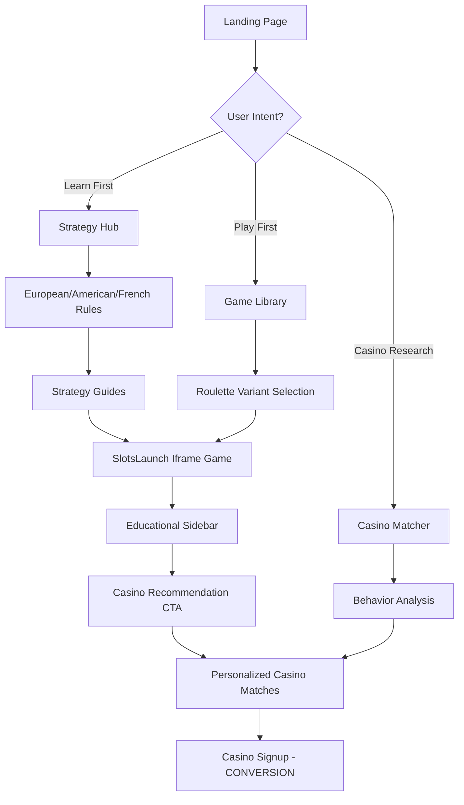
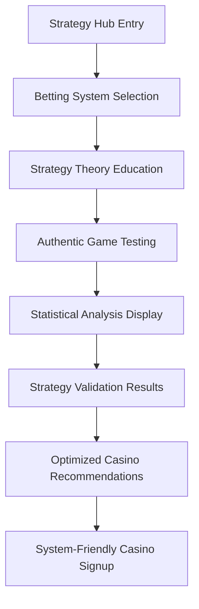
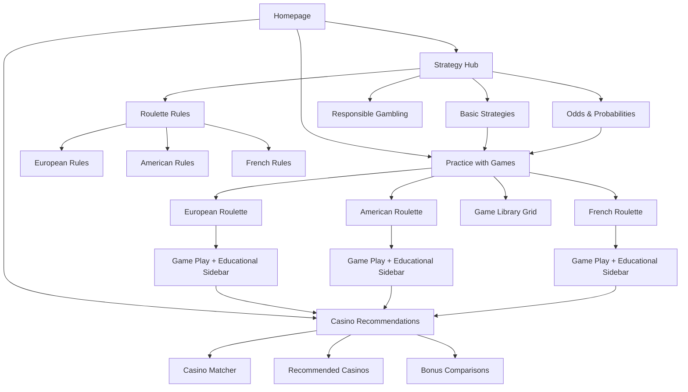

# Roulettesim.com UI/UX Specification

## Introduction

This document defines the user experience goals, information architecture, user flows, and visual design specifications for **Roulettesim.com**'s user interface. It serves as the foundation for visual design and frontend development, ensuring a cohesive and user-centered experience that bridges the authenticity gap in roulette simulation while optimizing mobile-first conversion.

## Overall UX Goals & Principles

### Target User Personas

**High-Intent Casino Prospects (Primary):** College-educated professionals (25-55, $50K+ income) seeking authentic roulette preview before real-money commitment. Research-oriented, moderate tech comfort, value transparency and expert guidance.

**Strategy System Testers (Secondary):** Analytical professionals (30-65, math/engineering background) who test betting progressions systematically. Seek statistical validation and robust testing environments.

### Usability Goals

**Clinical Authority:** Interface conveys professional casino preparation vs entertainment - users trust expertise immediately
**Conversion Confidence:** 8-12% casino signup rate through seamless education → practice → recommendation journey
**Mobile Performance:** <3 second loads with >90% mobile usability, optimized for SlotsLaunch iframe interaction
**Accessibility Compliance:** WCAG AA standard supporting YMYL content authority and inclusive access

### Design Principles

1. **Authenticity Over Entertainment** - Real casino preparation experience, not gamification
2. **Progressive Trust Building** - Expert credentials, transparency, responsible messaging throughout  
3. **Mobile-First Conversion** - Touch-optimized paths from discovery to casino recommendation
4. **Educational Authority** - Clinical presentation establishing YMYL-compliant expertise
5. **Seamless Integration** - SlotsLaunch iframe embedding feels native, not bolted-on

### Change Log

| Date | Version | Description | Author |
|------|---------|-------------|---------|
| 2025-09-03 | v1.0 | Initial UI/UX specification from PRD foundation | UX Expert |

## User Flows

### Primary Conversion Flow: Education to Casino Signup

**User Goal:** Move from roulette curiosity to confident real-money casino signup through authentic practice and education

**Entry Points:** Organic search, social media, competitor comparison, direct navigation

**Success Criteria:** User completes casino signup after engaging with educational content and authentic roulette practice

#### Flow Diagram

#### Edge Cases & Error Handling:
- **SlotsLaunch API Failure:** Graceful degradation to educational content with "Games temporarily unavailable" message
- **No Roulette Games Available:** Fallback to strategy content with notification about game restoration
- **Mobile Iframe Issues:** Progressive enhancement with touch-optimized fallback controls
- **Geographic Restrictions:** Casino recommendations filtered by user location with clear availability messaging
- **Rate Limit Exceeded:** Cached game data with refresh notification and educational content prioritization

**Notes:** This flow prioritizes educational touchpoints before and during authentic game practice, building confidence through multiple learning modalities before presenting conversion opportunities.

### Secondary Flow: Strategy System Testing

**User Goal:** Validate betting systems through authentic roulette environment before real-money implementation

**Entry Points:** Strategy-focused search queries, systematic gambling forums, competitor analysis

**Success Criteria:** User gains confidence in strategy approach and converts to recommended casino for implementation

#### Flow Diagram

**Notes:** This secondary flow serves strategy testers who need robust testing environments and statistical validation before casino commitment.

## Information Architecture (IA)

### Site Map / Screen Inventory

### Navigation Structure

**Primary Navigation:** Horizontal nav with three core sections - Games, Strategy, Casinos - designed for thumb-friendly mobile interaction using Accessible Astro Components navigation patterns

**Secondary Navigation:** Contextual breadcrumbs and in-content cross-links connecting educational content to relevant roulette variants for seamless learning-to-practice transitions

**Breadcrumb Strategy:** Educational pathways showing "Strategy → European Roulette Rules → Practice European Roulette" to encourage progression from learning to authentic game experience

## Wireframes & Key Screens

### Mobile Homepage (Primary - 60-70% of traffic)

**Layout Priority:** Clinical authority with immediate game access and clear educational pathways

**Above the Fold (320px width):**
- Site header with professional logo and clear navigation
- Hero section: "Master Roulette Before You Play" with expert credibility indicators
- Primary CTA: "Start Practicing Now" (to game selection)
- Secondary CTA: "Learn Strategy First" (to educational hub)

**Content Hierarchy:**
1. Trust signals (expert credentials, transparent approach)
2. Game access (featured roulette variants with authentic previews)
3. Educational pathways (strategy guides, rules explanations)
4. Casino recommendations (positioned as next logical step)

### Game Play Screen (Critical Conversion Point)

**Layout:** Split-screen design optimizing SlotsLaunch iframe integration

**Desktop Layout (1200px+):**
- Left Panel (60%): SlotsLaunch iframe roulette game
- Right Panel (40%): Educational sidebar with contextual strategy tips, betting guides, and progressive casino recommendations

**Mobile Layout (320-768px):**
- Full-width SlotsLaunch iframe game (top 70% of viewport)
- Collapsible educational drawer (bottom 30%, expandable to 60%)
- Floating action button for quick casino recommendations
- Touch-optimized controls for sidebar expansion

**Critical UX Elements:**
- Progressive disclosure: Educational content revealed as user engages with game
- Smart recommendations: Casino suggestions based on variant played and betting patterns observed
- Context-aware CTAs: "Find Casinos with This Variant" appears after 3+ minutes of play

### Strategy Hub (Educational Authority)

**Purpose:** Establish expert credibility while guiding toward authentic practice

**Content Architecture:**
- Overview of roulette variants with clear distinction between European (best odds), American (house advantage), and French (unique rules)
- Progressive betting system explanations with risk transparency
- Probability calculations and house edge education
- "Practice This Strategy" links connecting theory to SlotsLaunch game variants

## Component Library (Accessible Astro Components)

### Core Components from Accessible Astro Starter

**Foundation Components:**
- `<Header>` - Main site navigation with ARIA-compliant menu structure
- `<Navigation>` - Primary nav supporting 3-section architecture (Games/Strategy/Casinos)
- `<Button>` - Primary and secondary CTAs with conversion optimization
- `<Card>` - Game preview cards and strategy guide containers
- `<Modal>` - Educational overlays and casino recommendation dialogs

### Custom Components for Roulette Context

**Game Integration Components:**
- `<GameFrame>` - SlotsLaunch iframe wrapper with responsive sizing and accessibility enhancements
- `<EducationalSidebar>` - Contextual learning content with progressive disclosure
- `<StrategyTips>` - Smart betting guidance based on current game state
- `<CasinoRecommendations>` - Progressive casino suggestions with filtering by game variant

**Trust Building Components:**
- `<ExpertCredentials>` - Professional authority indicators and transparency signals
- `<ResponsibleGambling>` - Prominent risk awareness and limit-setting tools
- `<AuthenticityIndicators>` - Visual cues distinguishing simulation from entertainment gaming

**Conversion Components:**
- `<ProgressiveCTA>` - Smart call-to-action appearing based on user engagement patterns
- `<CasinoMatcher>` - Personalized recommendation engine with clear next-steps
- `<TrustSignals>` - Licensing, security, and responsible operator indicators

### Component Specifications

**Responsive Behavior:**
- All components must support 320px minimum width
- Touch targets minimum 44px for mobile accessibility
- Hover states converted to touch-friendly interactions
- Progressive enhancement for advanced desktop features

**Performance Requirements:**
- Lazy loading for non-critical components
- Optimized for <3 second initial page load
- SlotsLaunch iframe must maintain responsive aspect ratios across devices
- Educational content loaded progressively to avoid blocking game access

## Visual Design & Branding

### Clinical Professional Aesthetic

**Design Philosophy:** Professional casino preparation tool, not entertainment gaming platform

**Visual Hierarchy:**
- Clean typography establishing immediate credibility (professional, readable, authoritative)
- Restrained color palette avoiding typical casino-gaming associations (reds, golds, flashy elements)
- Expert-focused imagery (analytical charts, probability tables, professional headshots)
- Subtle animations building confidence, never distracting from educational content

### Color Palette

**Primary Colors:**
- Deep Navy (#1a365d) - Authority, trust, professional credibility
- Clean White (#ffffff) - Clarity, transparency, clinical presentation
- Sage Green (#38a169) - Growth, smart decisions, positive outcomes
- Warm Gray (#4a5568) - Neutral expertise, sophisticated analysis

**Accent Colors:**
- Gold Highlight (#f6ad55) - Used sparingly for key conversion points only
- Alert Red (#e53e3e) - Risk warnings and responsible gambling messages
- Info Blue (#3182ce) - Educational callouts and strategy explanations

**Usage Guidelines:**
- Primary CTAs use Sage Green to associate positive action with smart preparation
- Casino recommendations use subtle Gold highlights to indicate value
- Educational content uses Info Blue for trustworthy guidance
- Risk warnings always use Alert Red for immediate recognition

### Typography

**Heading Hierarchy:**
- H1: 32px (mobile) / 48px (desktop) - Deep Navy, establishing immediate authority
- H2: 24px (mobile) / 36px (desktop) - Deep Navy, section importance
- H3: 20px (mobile) / 28px (desktop) - Warm Gray, subsection clarity
- Body: 16px (mobile) / 18px (desktop) - Warm Gray, optimal readability

**Font Selection:**
- Professional sans-serif optimizing for mobile readability and casino industry credibility
- Avoid gaming-associated fonts (ornate, decorative, entertainment-focused)
- Prioritize accessibility with high contrast ratios and dyslexia-friendly character spacing

## Accessibility Requirements (WCAG AA Compliance)

### YMYL Content Standards

**Critical Compliance Areas:**
- All financial recommendations (casino selections) meet highest transparency standards
- Responsible gambling resources prominently available on every page
- Risk warnings clearly communicated with appropriate visual hierarchy
- Expert credentials and site authority clearly established and verifiable

### Technical Accessibility

**Keyboard Navigation:**
- Complete site functionality accessible via keyboard-only interaction
- Logical tab order prioritizing educational content before conversion elements
- SlotsLaunch iframe integration maintains keyboard accessibility without trapping focus

**Screen Reader Optimization:**
- Semantic HTML structure with descriptive headings and landmarks
- Alternative text for all visual content including game screenshots and strategy diagrams
- Live regions announcing game state changes and educational content updates
- Clear labeling of all form elements and interactive components

**Visual Accessibility:**
- 4.5:1 minimum contrast ratio for all text (AAA standard for enhanced credibility)
- Text scalable to 200% without horizontal scrolling
- Color never the sole indicator of meaning (especially for betting guides and risk warnings)
- Motion respects user preferences with reduced animation options

### Mobile Accessibility

**Touch Interaction:**
- 44px minimum touch targets for all interactive elements
- Sufficient spacing between touch targets to prevent misactivation
- Swipe gestures for educational content browsing with fallback navigation
- Voice input support for strategy searches and casino filtering

## Responsiveness Strategy

### Mobile-First SlotsLaunch Integration

**Critical Challenge:** Embedding third-party roulette games while maintaining seamless user experience and educational context

### Breakpoint Strategy

**Mobile Portrait (320-480px):**
- Single column layout prioritizing game access
- Educational content in collapsible drawer system
- Simplified navigation with clear hierarchy
- SlotsLaunch iframe fills 70% of viewport height

**Mobile Landscape (481-768px):**
- Optimized for game play with minimal educational distractions
- Side-sliding educational panel accessible via edge swipe
- Iframe maintains proper aspect ratio without horizontal scrolling
- Quick access to casino recommendations via floating action button

**Tablet (769-1024px):**
- Introduction of dual-panel layout with games and education side-by-side
- Iframe maintains optimal dimensions while educational content gains permanent visibility
- Enhanced touch targets for strategy guide navigation
- Progressive disclosure of advanced betting system information

**Desktop (1025px+):**
- Full split-screen experience with game on left, education on right
- Advanced filtering and sorting options for game library
- Detailed strategy comparisons with statistical overlays
- Enhanced casino matching with comprehensive comparison tables

### SlotsLaunch Iframe Optimization

**Technical Implementation:**
- Responsive aspect ratio containers maintaining game playability across devices
- Progressive enhancement for iframe communication when available
- Fallback controls for touch interaction when iframe doesn't respond optimally
- Smart preloading of popular roulette variants to reduce perceived load times

**User Experience Integration:**
- Educational sidebar updates contextually based on game actions when possible
- Clear visual boundaries distinguishing simulation from educational content
- Seamless transition from practice to casino recommendations without disrupting game flow
- Persistent game state during educational content exploration

## Animation & Micro-Interactions

### Trust-Building Animations

**Purpose:** Build confidence in platform expertise while maintaining professional restraint

**Key Interaction Points:**

**Educational Content Revelation:**
- Smooth accordions revealing strategy explanations (300ms ease-out)
- Progressive disclosure of betting system complexity avoiding cognitive overload
- Contextual tooltips appearing on hover/tap with probability calculations
- Gentle highlighting of key concepts during reading flow

**Game-to-Education Bridge:**
- Subtle transitions connecting game actions to relevant educational content
- Smart highlighting when game events align with strategy explanations
- Progressive revelation of casino recommendations based on user engagement depth
- Confidence-building animations when users make strategic decisions

**Conversion Micro-Interactions:**
- Gentle pulsing on primary CTAs after educational engagement milestones
- Progressive enhancement of casino recommendation relevance indicators
- Smooth transitions from simulation environment to real-money consideration
- Trust-reinforcing animations during casino selection process

### Performance & Accessibility

**Animation Constraints:**
- Respect `prefers-reduced-motion` for users requiring minimal animation
- All animations serve functional purpose (indicating state, guiding attention, building confidence)
- Maximum 300ms duration for interface responsiveness
- Never interfere with SlotsLaunch iframe performance or user game interaction

**Mobile Optimization:**
- Touch-responsive animations providing immediate feedback
- Optimized for 60fps performance across mobile devices
- Battery-conscious animation choices avoiding unnecessary GPU usage
- Graceful degradation for older mobile browsers

### Conversion Psychology Integration

**Strategic Animation Timing:**
- Delayed casino recommendation appearance allowing educational engagement first
- Progressive trust indicators building throughout user session
- Confidence-reinforcing feedback when users demonstrate strategic understanding
- Subtle urgency indicators for high-value casino bonuses (without creating pressure)

**User Agency Preservation:**
- All animations stoppable or skippable by user action
- Clear control over educational content pacing and revelation
- Transparent indication of progression through learning materials
- User-controlled transition from education to authentic practice to real-money consideration

---

This specification now provides comprehensive guidance for implementing the mobile-first, conversion-optimized roulette simulation platform. The design balances clinical authority with user-friendly accessibility while seamlessly integrating SlotsLaunch's iframe games within an educational context that builds toward casino recommendations.